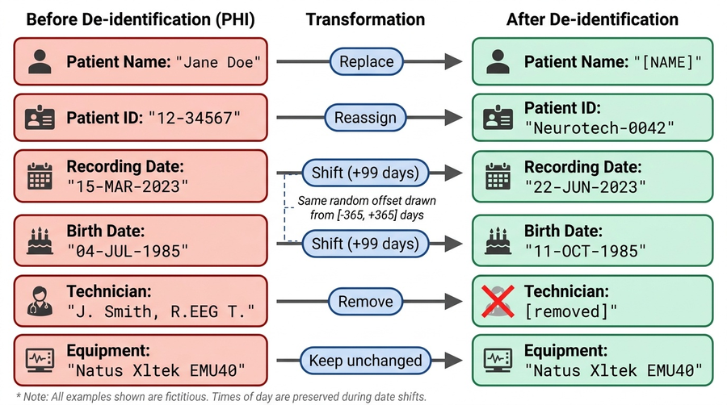

# Neurotech EEG Dataset: BIDS Conversion Pipeline

Pipeline for converting clinical Natus/Xltek NeuroWorks EEG recordings into a de-identified, BIDS-compliant dataset and uploading to the [Brain Data Science Platform (BDSP)](https://bdsp.io).

**Dataset:** 1,748 patients | 18,896 EDF recordings | ~67,500 hours | 256 Hz | 10-20 montage

**Target:** `s3://bdsp-opendata-repository/EEG/bids/Neurotech/`

## De-identification

All recordings are de-identified before release. Patient names, IDs, and dates of birth are removed from EDF headers. Recording dates are shifted by a random per-patient offset. Names embedded in technician annotations are scrubbed.



*All examples shown are fictitious. Date shifts are random per patient and applied consistently across all files for that patient.*

## Pipeline Overview

The pipeline has four stages:

1. **Inventory** (`extract_inventory.py`) -- Scan all patient folders, read EDF headers, parse `.lay` annotation files, produce summary CSVs
2. **Linking table** (`generate_linking_table.py`) -- Assign de-identified patient IDs (`Neurotech-1`, `Neurotech-2`, ...), generate random date shifts, handle duplicate patients across visits
3. **BIDS conversion** (`build_bids.py`) -- Copy EDF files with de-identified headers, generate BIDS sidecar files (`_eeg.json`, `_channels.tsv`, `_Xltek.csv`, `_scans.tsv`), upload to S3
4. **Dashboard** (`dashboard/index.html`) -- Live progress tracking with burndown charts (served locally, tunneled via ngrok)

## Quick Start

### Prerequisites

- Python 3.12+
- External drive with Natus/Xltek EEG export mounted at `/Volumes/Padlock_DT`
- AWS credentials with write access to `s3://bdsp-opendata-repository/`

### Setup

```bash
git clone https://github.com/bdsp-core/Neurotech-EEG-Wrangling.git
cd Neurotech-EEG-Wrangling
uv venv .venv
source .venv/bin/activate
uv pip install pyedflib pandas edfio
```

### Step 1: Inventory

```bash
python extract_inventory.py
```

Produces `output/recordings.csv`, `output/annotations.csv`, `output/patients.csv`.

### Step 2: Linking Table

```bash
python generate_linking_table.py
```

Produces `output/linking_table.csv` (maps de-identified IDs to original identifiers -- **do not publish**) and `output/patient_summary.csv`.

### Step 3: BIDS Conversion + S3 Upload

```bash
export AWS_ACCESS_KEY_ID=...
export AWS_SECRET_ACCESS_KEY=...
export AWS_DEFAULT_REGION=us-east-1
python -u build_bids.py 2>&1 | tee output/bids_conversion.log
```

This will:
- Read each EDF file from the external drive
- Skip empty/corrupt files (<512 bytes)
- Copy the EDF and patch the header in-place (de-identify patient info, shift dates)
- Generate BIDS sidecar files
- Scrub names and shift dates in annotation text
- Upload each session to S3
- Delete local copy after successful upload (to save disk space)

The pipeline is **resumable** -- progress is tracked in `output/bids_progress.tsv`. If interrupted, re-run the same command and it will skip already-completed folders.

### Step 4: Monitor Progress (optional)

```bash
# Start local dashboard
cd dashboard && python -m http.server 8080 &

# Tunnel for remote access (optional)
ngrok http 8080
```

## BIDS Output Structure

```
Neurotech/
  dataset_description.json
  participants.tsv
  participants.json
  README
  sub-Neurotech1/
    ses-1/
      sub-Neurotech1_ses-1_scans.tsv
      eeg/
        sub-Neurotech1_ses-1_task-EEG_eeg.edf      # De-identified EEG
        sub-Neurotech1_ses-1_task-EEG_eeg.json      # Recording metadata
        sub-Neurotech1_ses-1_task-EEG_channels.tsv   # Channel descriptions
        sub-Neurotech1_ses-1_task-EEG_Xltek.csv      # Technician annotations
    ses-2/
      ...
  sub-Neurotech2/
    ...
```

## De-identification Details

| EDF Header Field | Method |
|---|---|
| Patient name | Replaced with `X X X X` |
| Patient ID / case number | Replaced with `X` |
| Date of birth | Replaced with `X` |
| Recording date | Shifted by random per-patient offset (uniform in [-365, +365] days) |
| Start time | Preserved (not PHI alone) |
| Technician | Replaced with `X` |
| Equipment | Preserved |

**Annotation free-text scrubbing:**
- Patient's own first/last name replaced with `[NAME]` (exact match, any word length)
- All first/last names from the dataset (4+ characters) matched and replaced
- Dates in text (MM/DD/YYYY, MM/DD/YY, DD.MM.YYYY) detected and shifted

## Key Files

| File | Description |
|---|---|
| `extract_inventory.py` | Scan EDF headers and parse annotations |
| `generate_linking_table.py` | Assign de-identified IDs and date shifts |
| `build_bids.py` | BIDS conversion, de-identification, S3 upload |
| `dashboard/index.html` | Live progress dashboard |
| `output/linking_table.csv` | ID mapping (**do not publish**) |
| `PLAN.md` | Detailed project plan |

---

## EHR Extraction Pipeline (`ehr_pipeline/`)

Extracts structured clinical data from Neurotech's scanned EHR/Patient Forms PDFs. Each PDF is a multi-document packet containing the technologist scan report, intake form, clinical notes, monitoring logs, and other paperwork for one EEG study.

**Source:** `/Users/mwestover/GithubRepos/Neurotech-EHR/` (not in git -- contains PHI)

**Scale:** 2,469 PDFs | 41,926 pages | 132.9M characters | 12,440 sub-documents | 17 output CSVs

### Prerequisites

```bash
# OCR tools (needed for ~80% of PDFs that contain scanned pages)
brew install tesseract ocrmypdf

# Local LLM for clinical-note extraction (runs on-device, no PHI egress)
# pip install mlx-lm    # Apple Silicon; the Qwen model auto-downloads on first run
```

### Three-stage pipeline

#### Stage 1: Extract raw text

```bash
python ehr_pipeline/extract_text.py --workers 6 --ocr-jobs 2
```

For each PDF, runs `pdftotext -layout`. If text density is low (scanned pages), runs `ocrmypdf --skip-text --rotate-pages --deskew` to OCR image pages, then re-extracts. Outputs co-located with each source PDF:

- `<name>.raw.txt` -- full layout-preserved plain text
- `<name>.raw.jsonl` -- one JSON object per page (`{page, chars, ocr_used, text}`)
- `<name>.meta.json` -- SHA1, page count, OCR flag

**Resumable** via `output/ehr/manifest.tsv` (SHA1-keyed). Re-runs skip unchanged files.

**Performance:** ~6 s/PDF with 6 workers × 2 OCR jobs. ~2,500 PDFs in ~3 hours.

#### Stage 2: Segment documents

```bash
python ehr_pipeline/segment_documents.py
# Or in watch mode (re-scans every 5s for new Stage 1 output):
python ehr_pipeline/segment_documents.py --watch
```

Classifies each page by regex landmark patterns, then collapses consecutive same-type pages into sub-document ranges. Document types detected:

| Type | Description | Count |
|---|---|---|
| `tech_scan_report` | Neurotech technologist EEG scan report | 2,871 |
| `eeg_intake_form` | Long Term EEG Medical Necessity form | 2,701 |
| `trackit_monitoring_log` | Hour-by-hour monitoring table | 2,192 |
| `clinical_progress_note` | Neurology/epilepsy clinic notes | 1,589 |
| `hipaa_consent` | HIPAA/consent boilerplate (skipped) | 1,319 |
| `imaging_report` | MRI/CT reports | 430 |
| `history_and_physical` | H&P documents | 240 |
| `eeg_order` | EEG order from referring site | 226 |
| `lab_results` | Laboratory results | 135 |
| `patient_event_log` | Patient-reported event diaries | 39 |
| `unknown` | Fax covers, external referrals, etc. | 698 |

Output: `<name>.sections.json` + global `output/ehr/sections_summary.tsv`

**Performance:** ~2,500 packets in ~35 seconds (pure regex, no LLM).

#### Stage 3: Extract structured fields

```bash
# Full run: narrative notes -> local on-device LLM (no PHI leaves the machine)
python ehr_pipeline/extract_fields.py --concurrency 8

# Regex-only (no LLM cost, no clinical note extraction)
python ehr_pipeline/extract_fields.py --skip-llm

# Watch mode (picks up new Stage 2 output automatically)
python ehr_pipeline/extract_fields.py --watch --concurrency 8
```

Dispatches each sub-document to a type-specific extractor:

- **Regex extractors** (free, deterministic): `tech_scan_report`, `trackit_monitoring_log`, `eeg_order`
- **Local on-device LLM** (Qwen via Apple MLX; no network, no PHI egress): `clinical_progress_note`, `history_and_physical`, `eeg_intake_form`, `imaging_report`, `lab_results`, `patient_event_log`
- **Skipped**: `hipaa_consent`, `unknown`

Output: `<name>.fields.json` + global `output/ehr/fields_manifest.tsv`

**Performance:** runs locally on Apple Silicon; no API keys, no per-call cost. Throughput scales with the machine's GPU.

**Key features:**
- JSON repair for truncated LLM output (closes open strings/brackets)
- Runs entirely on-device via Apple MLX — no network calls, no rate limits, no PHI egress
- TrackIT hourly row parser: extracts every hour-by-hour monitoring entry with timestamps, impedance, battery %, reviewer names
- Patient event timestamp extraction from tech reports

#### Stage 4: Build summary CSVs

```bash
python ehr_pipeline/build_csvs.py
```

Aggregates all `fields.json` into 17 queryable CSVs under `output/ehr/`:

| CSV | Rows | Description |
|---|---|---|
| `studies.csv` | ~2,600 | One row per EEG study |
| `eeg_background.csv` | ~2,600 | PDR frequency, symmetry, sleep stages |
| `eeg_slowing.csv` | ~1,100 | Studies with abnormal slowing |
| `eeg_epileptiform.csv` | ~1,400 | Studies with interictal discharges |
| `eeg_seizures.csv` | ~780 | Studies with documented seizures |
| `technologist_impression.csv` | ~2,600 | Normal/abnormal classification |
| `patient_events.csv` | ~1,350 | Timestamped patient-reported events |
| `monitoring_hours.csv` | ~100,000 | Hour-by-hour recording status |
| `monitoring_events.csv` | ~59,000 | Timestamped tech review notes |
| `clinical_encounters.csv` | ~1,400 | Provider, chief complaint, assessment |
| `conditions.csv` | ~7,500 | Past medical history entries |
| `medications.csv` | ~7,900 | Medications with dose/frequency |
| `diagnosis_codes.csv` | ~3,300 | ICD-10 codes |
| `imaging.csv` | ~320 | MRI/CT findings |
| `lab_results.csv` | ~100 | Lab panels |
| `monitoring_summary.csv` | ~2,100 | Per-study monitoring summary |
| `eeg_activations.csv` | ~2,600 | Photic/HV results |

### Live progress dashboard

```bash
# Local only
./dashboard_ehr/start.sh

# With public tunnel (PHI-sanitized -- patient names hashed before writing)
./dashboard_ehr/start.sh --ngrok
# Or use cloudflared:
cloudflared tunnel --url http://localhost:8081 --no-autoupdate
```

The dashboard shows all three stages with progress bars, burndown charts, and rate metrics. PHI is automatically sanitized (patient names → `pt-XXXXXX`, IDs → `[id]`, dates → `[date]`) before any data touches the progress JSON files.

### Processing a new batch of PDFs

To process additional patient PDFs (e.g., the I-Z batch):

1. Place PDFs under `Neurotech-EHR/` in the standard folder structure (`Last, First-NNNNNN/Patient Forms/*.pdf`)
2. Run the three stages in order -- each is resumable and will only process new/changed files:

```bash
# Stage 1: extract text (parallelized, ~3h for 2,500 PDFs)
python ehr_pipeline/extract_text.py --workers 6 --ocr-jobs 2

# Stage 2: segment (fast, <1 min)
python ehr_pipeline/segment_documents.py

# Stage 3: extract fields (narrative notes via local on-device LLM)
python ehr_pipeline/extract_fields.py --concurrency 8

# Stage 4: rebuild CSVs
python ehr_pipeline/build_csvs.py
```

3. To run all stages as a continuous pipeline (each stage watches for upstream output):

```bash
python ehr_pipeline/extract_text.py --workers 6 --ocr-jobs 2 &
python ehr_pipeline/segment_documents.py --watch &
python ehr_pipeline/extract_fields.py --watch --concurrency 8 &
```

### Key files

| File | Description |
|---|---|
| `ehr_pipeline/extract_text.py` | Stage 1: OCR + text extraction |
| `ehr_pipeline/segment_documents.py` | Stage 2: document boundary detection |
| `ehr_pipeline/extract_fields.py` | Stage 3: regex + local-LLM field extraction |
| `ehr_pipeline/build_csvs.py` | Stage 4: aggregate into queryable CSVs |
| `ehr_pipeline/llm_client.py` | Local (MLX) LLM client; optional cloud backends for non-PHI dev only |
| `ehr_pipeline/progress.py` | Progress tracker with PHI sanitization |
| `ehr_pipeline/SCHEMA_PLAN.md` | Detailed schema design and field inventory |
| `dashboard_ehr/index.html` | Multi-stage live dashboard |
| `dashboard_ehr/start.sh` | Dashboard + tunnel launcher |

### Tuning and lessons learned

**Local LLM extraction:** narrative doc types are processed by a locally hosted open-weight model (Qwen via Apple MLX, `ehr_pipeline/llm_client.local_generate`). Extraction runs entirely on-device — no network calls, no API keys, no per-call cost, and no clinical text ever leaves the secure environment. Set `LOCAL_LLM_MODEL` to choose a different local model.

**If a re-run is needed:** the pipeline records per-section status in the manifest and re-runs retry only the failures — no work is lost.

**OCR speed:** `--workers 6 --ocr-jobs 2` is optimal on a 10-core M-series Mac. Stage 1 is CPU-bound (OCR). Stages 1 and 3 can run simultaneously.

### Known limitations

- **~80% of PDFs need OCR** (scanned pages mixed with digital text). OCR quality on handwritten intake forms is poor — patient demographics from those forms rely on LLM interpretation of noisy OCR.
- **Two tech report formats exist** (template-based vs structured). The regex parser handles both but the older template format occasionally has boundary issues.
- **Local LLM throughput** is bounded by the machine's GPU rather than any API rate limit; a larger `LOCAL_LLM_MODEL` trades speed for extraction quality.
- The `unknown` document type (698 sections) includes fax covers, external referrals, and satisfaction surveys that could be classified with additional regex rules.

---

## Manuscript Materials

The `manuscript-materials/` directory contains the draft manuscript, figures, and figure generation code for the associated data descriptor paper.

## Adapting for Other Datasets

To adapt this pipeline for a different Natus/Xltek EEG dataset:

1. Update `DRIVE_PATH` in all scripts to point to your data
2. Update `S3_BUCKET` and `S3_PREFIX` in `build_bids.py` for your target location
3. Adjust the `FOLDER_PATTERN` regex in `generate_linking_table.py` if your folder naming convention differs
4. Run Steps 1-3 in order

The pipeline handles:
- Multiple EDF segments per recording session
- Patients with multiple visits (same name, different case IDs)
- Malformed folder names (fallback regex matching)
- Large files (binary header patching, no signal data loaded into memory)
- Network interruptions (resumable via progress tracking)

## License

[TBD]

## Citation

[TBD -- data descriptor manuscript in preparation]
